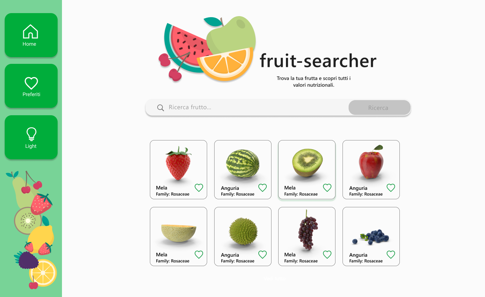

# Fruit-searcher

## Screenshots

## Informazioni sul progetto

Fruit-searcher, disponibile cilccando [qui](https://fruit-searcher.netlify.app/), è un semplice portale che ti consente di visualizzare informazioni relative ai frutti.

## Iniziare

Fruit-searcher è un' applicazione web e non necessita di alcuna installazione.
Cilccando [qui](https://fruit-searcher.netlify.app/) potrai iniziare ad utilizzarla immadiatamente.

## Funzionalità

Fruit-searcher permette di visuallizzare l'elenco di tutti i frutti. Grazie ad un pratico motore di ricerca sarà possibile visualizzare il frutto desiderato e le relative proprietà nutrizionali.
Dalla home-page sarà inoltre possibile aggiungere qualsiasi frutto alla sezione "preferiti" schiacciando sull'icona a forma di cuore posta affianco ad ogni frutto.
Caratteristiche e funzionalità:
- L'interfaccia amichevole.
- Memorizzazione frutti preferiti.
- Personalizzazione del background.

## Costruita con

- JavaScript
- HTML
- CSS

## Prossimi aggiornamenti

- [ ] Archiviazione dati
- [ ] Categorie frutti iper-ipocalorici

## Autore

**Edoardo Ottolenghi**

- [Profile](https://github.com/Edo-01 "Edoardo Ottolenghi")
- [Email](mailto:edoardo.ottolenghi@gmail.com?subject=Hi "Hi!")
- [Website](https://edo-01.github.io/E.O-Web-Site/)

## Supporto

Contributi e richieste di funzionalità sono i benvenuti!
